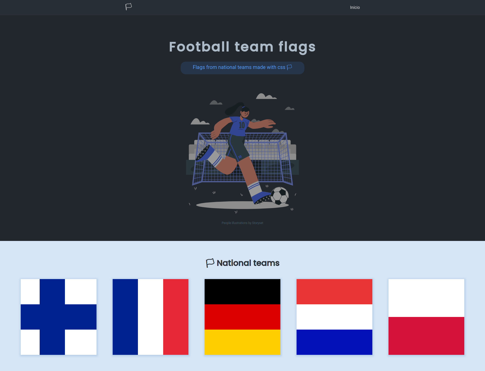
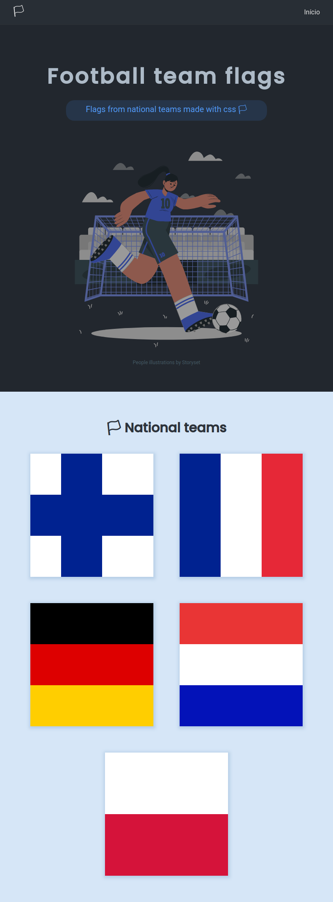

# Football team flags 🏳

Flags from national teams made with only CSS

<p align="center">
  <a></a>
</p>

<p align="center">
  <a></a>
</p>

## 🛠️ Stack

- SASS
- PUG
- Gulp to compile SASS and PUG to CSS and HTML respectively
- Git flow
- Responsive website
- Cross browser flexbox

## National team list

- 🇦🇹 Austria
- 🇧🇩 Bangladesh
- 🇧🇪 Belgium
- 🇧🇯 Benin
- Brazil
- 🇧🇬 Bulgaria
- 🇨🇴 Colombia
- Denmark
- 🏴󠁧󠁢󠁥󠁮󠁧󠁿 England
- 🇫🇮 Finland
- 🇫🇷 France
- 🇩🇪 Germany
- 🇮🇹 Italy
- Japan
- 🇳🇱 Netherlands
- 🇵🇼 Palau
- 🇵🇱 Poland
- Portugal
- Spain
- Switzerland

## Brazilian flag list

- Acré
- Alagoas
- Amapá
- Amazonas
- Bahia
- Ceará
- Distrito Federal
- Espirito Santo
- Goiás
- Maranhão
- Mato Grosso
- Mato Grosso do Sul
- Minas Gerais
- Pará
- Paraíba
- Paraná
- Pernambuco
- Piauí
- Rio Grande do Norte
- ☑️ Rio Grande do Sul
- Rio de Janeiro
- Rondônia
- Roraima
- São Paulo
- Santa Catarina
- Sergipe
- Tocantins

## How to Contribute

Please, read [CONTRIBUTION.md](https://github.com/laisfrigerio/football-team-flags/blob/main/CONTRIBUTION.md) file

## Run

First of all, we must clone the repository:

```
  $ git clone https://github.com/laisfrigerio/football-team-flags.git
```

Or case if it is a fork:

```
  $ git clone https://github.com/<your_username>/football-team-flags.git
```

And get into folder:

```
  $ cd football-team-flags
```

Then, install dependencies

```
  $ npm install
  $ npm run build
```

Lastly, you can downloaded the `Live Server` extension to start a local server to run the project

[Live Server extension info](https://marketplace.visualstudio.com/items?itemName=ritwickdey.LiveServer)

## :woman: Author

| [<br /><sub><b>@laisfrigerio</b></sub>](https://github.com/laisfrigerio)<br /> |
| :---: |

## 🧑‍🤝‍🧑 Contributors

| [<br /><sub><b>Lucas Marchiori</b></sub>](https://www.lucasbmarchiori.com.br/)<br /> | [<br /><sub><b>Natália Francisco</b></sub>](https://github.com/natalia-fs)<br /> | [<br /><sub><b>Anderson Coelho</b></sub>](https://github.com/AndersonAlvesCoelho)<br /> | [<br /><sub><b>Erismar Oliveira</b></sub>](https://github.com/erismaroliveira)<br /> | [<br /><sub><b>Eduardo Nogueira</b></sub>](https://github.com/dudunog)<br /> | [<br /><sub><b>Ruan Carlos</b></sub>](https://github.com/AguaPotavel)<br /> |
| :---: | :---: | :---: | :---: | :---: | :---: | 

## 📄 License

This project is licensed under the MIT License - see the LICENSE.md file for details
