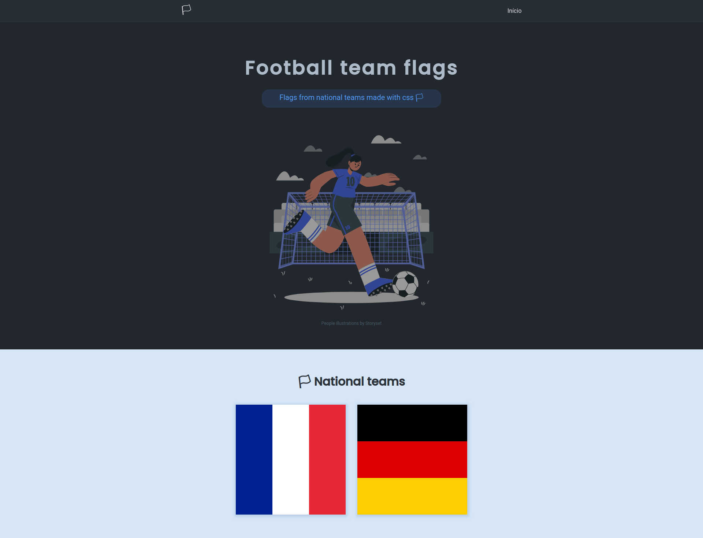

# Football team flags 🏳

Flags from national teams made with only CSS

<p align="center">
  <a></a>
</p>

## 🛠️ Stack

- SASS
- PUG
- Gulp to compile SASS and PUG to CSS and HTML respectively
- Git flow
- Responsive website
- Cross browser flexbox

## National team list

- Belgium
- Brazil
- Denmark
- England
- Finland
- 🇫🇷 France
- 🇩🇪 Germany
- Italy
- Japan
- Netherlands
- Poland
- Portugal
- Spain
- Switzerland

## Run

First of all, we must clone the repository:

```
  $ git clone https://github.com/laisfrigerio/football-team-flags.git
  $ cd football-team-flags
```

Then, install dependencies

```
  $ npm install
  $ npm run build
```

Lastly, you can downloaded the `Live Server` extension to start a local server to run the project

[Live Server extension info](https://marketplace.visualstudio.com/items?itemName=ritwickdey.LiveServer)

## Development

We use `git flow` to add new features and/or fix some bug's. To start, you must run the following command:

```
  $ git flow init
```

### Workflow:

To add a new flag, you must to create a feature, like:

```
  $ git flow feature start france
```

When completing the taks, you must `close` the feature:

```
  $ git flow feature finish france`
```

After running the command above, the content from `feature/france` will be merged automatically into `develop` branch

## Deploy to production

From `develop` branch, you must create a release:

```
  $ git flow release start 0.3.0
```

Then `close` the release:

```
  $ git flow release finish 0.3.0
```

After it, the release branch content will be merged automatically into `main` and `develop` branches, respectively.

The next command will send content to `develop` branch:

```
  $ git push
```

And lastly, send content to `main` branch:

```
  $ git checkout main
  $ git push
```

And create a new tag/version into github:

`$ git push --tags`

## :woman: Author

[@laisfrigerio](https://github.com/laisfrigerio/)

## 📄 License

This project is licensed under the MIT License - see the LICENSE.md file for details
